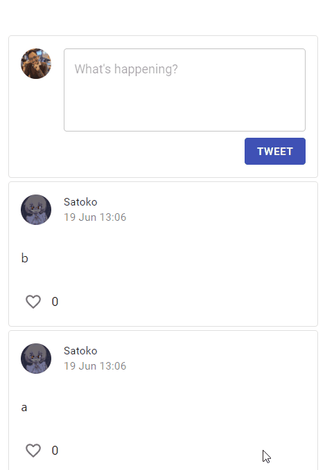
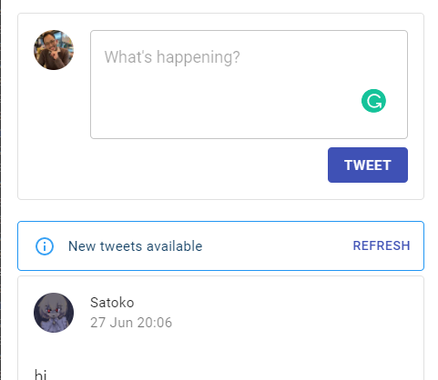

# Create a Twitter clone with React and Supabase

This is the source code repo for an ongoing tutorial series where we are making a twitter clone with React and [Supabase](https://supabase.io/) (an open-source Firebase alternative)

## Tutorial

- [Part 1: Setting up Supabase and the project](https://medium.com/geekculture/a-step-by-step-guide-to-creating-a-twitter-clone-with-react-and-supabase-part-1-d6865ade095a)
- [Part 2: Routing with React-Router, validation with react-hook-form](https://medium.com/geekculture/a-step-by-step-guide-to-creating-a-twitter-clone-with-react-and-supabase-part-2-43fd11558fc1)
- [Part 3: Finishing Sign Up flow, generating types](https://medium.com/geekculture/step-by-step-guide-to-creating-a-twitter-clone-with-react-and-supabase-part-3-1c7ece96b77b)
- [Part 4: Using Storage and querying complex relations ia Postgres functions](https://medium.com/geekculture/create-a-twitter-clone-with-supabase-part-4-using-storage-and-postgres-stored-procedures-7e2342eede3)
- Part 5: Infinite List and realtime notification (currently being written)
- Part 6: Final touches and deployment

## Features

### Password Auth and User Profile

Auth flow and Avatar Uploading implemented Supabase Auth and Supabase Storage.

### Infinite scrolling

Infinite scrolling implemented using [react-query](https://react-query.tanstack.com/).

### Real-time notification 

Alerts and notification implmented using [Supabase Realtime](https://supabase.io/docs/realtime/server/about)

